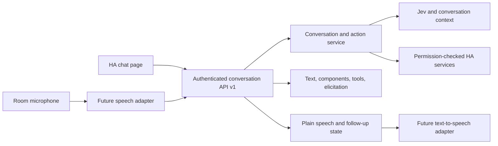

# Reuse Home chat from another client

**The HA page and future voice adapters use the same API.** Send JSON to `POST /api/typesafe_chat` on your existing local or remote HA address. Use `apiVersion: 1` and an HA Bearer token. The private Node bridge is not a public endpoint.

The contract is available as [OpenAPI 3.1](../custom_components/typesafe_chat/www/chat-api.openapi.json), served by HA at `/typesafe-chat/chat-api.openapi.json`. The dependency-free [client](../custom_components/typesafe_chat/www/chat-client.js) works in browsers and Node.js 22+. Existing unversioned requests remain compatible; new integrations should use v1.

## One backend, different outputs



UI rendering is optional. `ChatService` owns conversations, location, previews, approvals, history, and tool records. `ChatApi` validates the versioned contract and handles durable request IDs. The HA integration supplies authenticated identity, permissions, inventory, and a request-scoped token. Providers and device calls are shared by every client.

## Connect a client

```js
import { createChatClient, createHttpTransport } from './custom_components/typesafe_chat/www/chat-client.js';

const client = createChatClient({
  client: { kind: 'voice', deviceId: 'office-microphone' },
  transport: createHttpTransport({
    baseUrl: process.env.HA_URL,
    token: () => process.env.HA_TOKEN,
  }),
});

const created = await client.call('new', { location: 'EXACT_ID_FROM_ROOMS' });
const threadId = created.conversation.id;
const answer = await client.call('send', { threadId, text: 'Turn on the lights' });
// Speak answer.reply.speech, then listen if answer.reply.continueConversation.
// A spoken "yes" must carry the proposal that the listener just heard:
const confirmationId = answer.reply.elicitation?.id;
// Only after the user actually confirms:
// await client.call('send', { threadId, text: 'yes', confirmationId });
```

For the HA browser, inject its existing authenticated transport: `transport: request => hass.callApi('POST', 'typesafe_chat', request)`. Keep tokens on a trusted gateway when integrating small voice satellites; do not expose provider or bridge keys to devices.

The [runnable transcript client](../examples/voice-client.mjs) exercises this contract without microphones or TTS:

```sh
# HA_URL and HA_TOKEN come from your shell, never command-line arguments.
node examples/voice-client.mjs --device office-microphone --locations
node examples/voice-client.mjs --device office-microphone --location EXACT_ID
# Resume a saved conversation from this same device:
node examples/voice-client.mjs --device office-microphone --thread THREAD_ID
```

It accepts typed transcripts and prints the text a speech adapter would speak. `/location ID`, `/cancel`, `/recover`, and `/archive` use the same API. A typed `yes` applies the current confirmed proposal to real HA devices.

## Request contract

All requests contain `apiVersion: 1`, `op`, and `client`. A web client is `{kind:"web"}`; a voice client is `{kind:"voice",deviceId:"stable-device-id"}`. Mutations require a unique `requestId`; the helper creates it. All operations except `bootstrap` and `new` require an explicit `threadId`. Unsupported fields are rejected, including caller-supplied identity.

| Operation | Extra fields | Result |
| --- | --- | --- |
| `bootstrap` | Optional `threadId` for web | Discover rooms and capabilities; web also restores its selected chat. Voice discovery does not select a chat. |
| `new` | Optional `location` | Create a conversation and return its ID. No existing `threadId`. |
| `open` | Optional `toolDetailsId` | Read saved history, or a saved tool payload owned by this conversation. |
| `send` | `text` **or** `componentAction`; optional `confirmationId`, `selected` | Interpret a message or preview a saved card action. |
| `apply` | `messageId`, `selected` action indexes | Apply only the current reviewed proposal. |
| `cancel` | None | Cancel the current proposal. |
| `location` | `location` ID, or `""` to clear | Change exact room/space; may resume a location question. |
| `rename` | `title` | Rename this conversation. |
| `archive` | Optional `targetThreadId`, `archived` (default `true`) | Archive or restore; cancels pending approvals. |

`componentAction` is `{messageId, entityId, action, value?}`. Use only controls returned in that message’s versioned `components`. The backend checks the owning conversation, current capabilities, permissions, and allowed ranges. It creates a preview; it never bypasses approval.

For typed or spoken affirmative replies such as `yes` or `sim`, send `confirmationId` from the proposal the user actually saw/heard. For a subset, also send `selected`. Natural-language revisions replace the old proposal. Never turn ambient speech into an implicit approval.

## Response contract

Existing `user`, `rooms`, `threads`, `archivedThreads`, and `thread` data remain available to screen clients. V1 adds:

| Field | Meaning |
| --- | --- |
| `apiVersion`, `requestId`, `replayed` | Version and request recovery metadata. |
| `capabilities` | Operations, client types, component version, and request retention limits. |
| `conversation` | ID, location, archive state, source device, and whether the speaker is known. Absent for discovery or tool-detail-only responses. |
| `reply.text` | Full assistant text, including data behind visual cards. |
| `reply.speech` | Text for TTS. Confirmation/location prompts work without a screen. Empty on reads and replayed requests. |
| `reply.status` | `complete`, `error`, `awaiting_confirmation`, `awaiting_location`, `awaiting_reply`, or `archived`. `complete` means the turn ended; check text and observed device results for actuation success. |
| `reply.continueConversation` | Whether another user response is needed. |
| `reply.elicitation` | Confirmation ID/actions/expiry, location options, or a free-text clarification. |
| `reply.components`, `reply.tools` | The same generative UI data and saved tool references used by the page. Optional to render. |

`reply` is null on discovery, tool-detail-only responses, and request replays. An `open` response can show the current elicitation but does not automatically repeat speech. Cards are timestamped snapshots; tool inspection never executes a tool again.

## Room devices and people are different context

Each voice conversation stores its originating `deviceId` and its exact location. An office microphone and a bathroom microphone can use different app spaces inside the same HA room. Obtain IDs from `rooms`; do not guess them from labels. Device-to-space configuration belongs in the future adapter. Presence inference remains a future feature.

A device ID is a routing label, **not authentication or speaker recognition**. The HA account authenticates access and owns history. A shared voice device always has `speaker: {known:false,name:null}` and gives Jev no personal-office identity. “My office” asks for the person’s room explicitly. Voice requests cannot continue or confirm another device’s conversation, and they do not change the chat selected in the browser. A trusted client with the same HA token still has that account’s permissions; use separate HA accounts when separate access boundaries are needed.

Web conversations retain authenticated-account context. A voice-origin conversation remains a shared, unknown-speaker conversation even when opened in the UI. Future verified speaker identification requires its own trusted identity mechanism; arbitrary names in a request will not implement it.

## Retries and simultaneous requests

Prepare once, retain the payload, then execute:

```js
const request = client.prepare('send', { threadId, text: transcript });
const result = await client.execute(request);
// If the HTTP response is lost, recover using exactly the same request object.
// Never generate a new requestId merely because the first response was lost.
```

Before a mutation starts, the server saves its request fingerprint and processing state. Repeating a completed request returns current saved conversation state with `replayed:true` and `reply:null`; it does not evaluate, speak, or actuate again. Reusing its ID with different input returns `request_conflict`. A process interruption with uncertain outcome returns `request_incomplete`; inspect the conversation and device state before starting a new action.

Records are retained for 24 hours, up to 10,000 accepted mutations per account in that window; unfinished records remain for recovery. Reaching the limit rejects new mutations instead of evicting protection for earlier requests. Never retry an old request outside this window. Previews still expire after two minutes, after a bridge restart, or when target state changes. Restoring an archived chat cannot revive a proposal.

Requests serialize per HA account to prevent history and action races. Another in-flight request receives HTTP 409 with `code:"busy"`; an adapter may defer the same payload until the account is idle. The client library makes no automatic retries. Different accounts have independent sessions. Use a sufficiently long HTTP timeout: the bridge allows 75 seconds and HA’s proxy allows 85 seconds.

Common v1 error codes: `invalid_request`, `unsupported_version`, `thread_required`, `thread_not_found`, `invalid_client`, `confirmation_mismatch`, `conversation_mismatch`, `request_conflict`, `request_incomplete`, `request_limit`, `operation_failed`, and `busy`. Error responses keep a readable `error` string. HA authentication/proxy errors may use their own format; the client normalizes them to `ChatClientError`.

## Connecting actual voice hardware later

The next adapter maps **recognized speech → `send`**, **`reply.speech` → TTS**, and **`continueConversation` → keep listening**. It must retain a conversation per device/session, carry the pending confirmation ID, resolve spoken location choices against returned options, and archive finished sessions as appropriate. It should use HA’s current Assist exposure rules in addition to this API’s permissions when integrating Assist.

[HA Assist pipelines](https://developers.home-assistant.io/docs/voice/pipelines/) handle speech recognition and synthesis; [HA’s Conversation API](https://developers.home-assistant.io/docs/intent_conversation_api/) has conversation IDs and continuation flags. A native HA conversation-entity/Assist adapter is **not installed by this change**. Audio streaming, wake words, TTS, microphone provisioning, and speaker recognition are outside this text API. The shared conversation and device-action backend is ready for that adapter.
